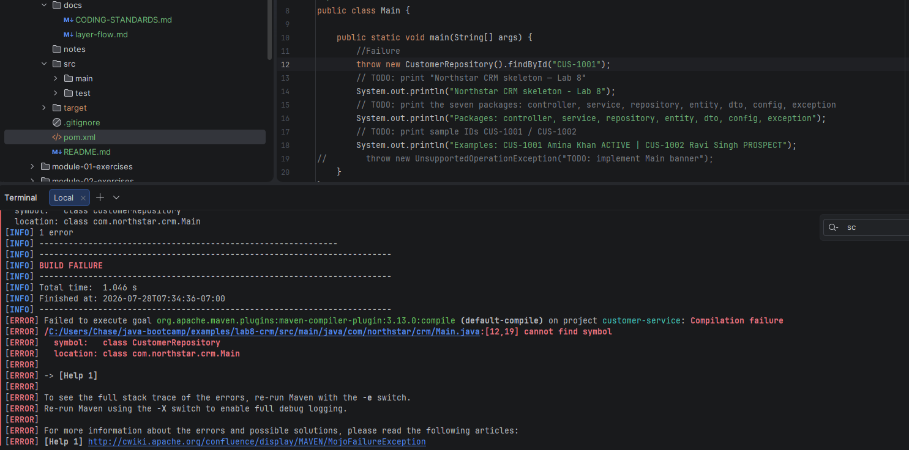
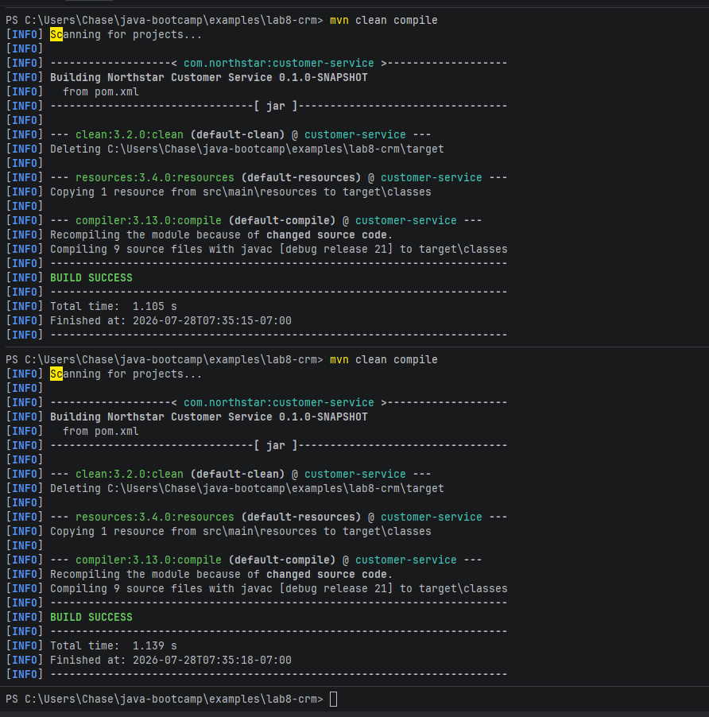
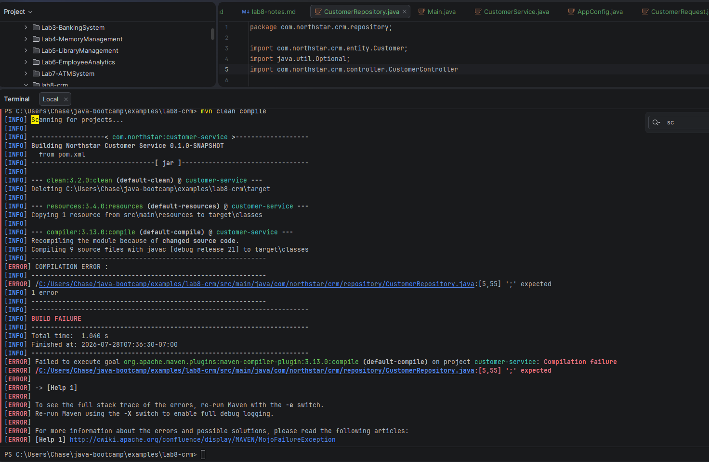

## Failure Checkpoints:

1. Rename pom.xml temporarily; run mvn compile - my code editor wont let me rename pom.xml
2. 	Call new CustomerRepository().findById("CUS-1001") from a throwaway main

3. Run mvn clean compile twice

4. Temporarily import com.northstar.crm.controller.CustomerController inside CustomerRepository

## Implementation Checkpoints

### Checkpoint A — Project root + Maven layout

_Mark each row **Pass** or **Fail** in your lab notes (GitHub markdown files are not interactive checklists)._

| # | Confirm                                                                                          | Your notes |
| - |--------------------------------------------------------------------------------------------------|------------|
| 1 | `~/java-bootcamp/examples/lab8-crm/pom.xml` with `com.northstar:customer-service:0.1.0-SNAPSHOT` | Pass       |
| 2 | Standard `src/main/java`, `src/main/resources`, `src/test/java` exist                            | Pass       |
| 3 | Seven packages under `com.northstar.crm`                                                         | Pass       |
| 4 | Edited via IntelliJ (or optional VS Code)                                                        | Pass       |

### Checkpoint B — Stubs compile and Main runs

_Mark each row **Pass** or **Fail** in your lab notes (GitHub markdown files are not interactive checklists)._

| # | Confirm                                                                               | Your notes |
| - |---------------------------------------------------------------------------------------|------------|
| 1 | Entity, DTOs, repository, service, controller, config, exception, Main present        | Pass       |
| 2 | `mvn clean compile` → `BUILD SUCCESS`                                                 | Pass       |
| 3 | `java -cp target/classes com.northstar.crm.Main` prints skeleton banner + example IDs | Pass       |
| 4 | No Spring/JPA/Kafka imports in source                                                 | Pass       |

### Checkpoint C — Documentation

_Mark each row **Pass** or **Fail** in your lab notes (GitHub markdown files are not interactive checklists)._

| # | Confirm                                                                     | Your notes |
| - |-----------------------------------------------------------------------------|------------|
| 1 | `docs/layer-flow.md` narrates `CUS-1001` / `lab-request-001` through layers | Pass       |
| 2 | `docs/CODING-STANDARDS.md` states hard layer rules                          | Pass       |
| 3 | Project `LAB-8-GUIDE.md` explains compile/run                               | Pass       |

### Checkpoint D — Failure evidence + security

_Mark each row **Pass** or **Fail** in your lab notes (GitHub markdown files are not interactive checklists)._

| # | Confirm                                                      | Your notes |
| - |--------------------------------------------------------------|------------|
| 1 | At least three failure experiments recorded                  | Pass       |
| 2 | Layer-direction violation experiment understood and reverted | Pass       |
| 3 | No secrets / `target/` committed; concepts answers drafted   | Pass       |

| # | Experiment                                                                                       | Observe | Restore |
| - |--------------------------------------------------------------------------------------------------| ------- | ------- |
| 1 | Rename `pom.xml` temporarily; run `mvn compile`                                                  | Maven cannot find POM / build failure | Restore filename |
| 2 | Call `new CustomerRepository().findById("CUS-1001")` from a throwaway main                       | `UnsupportedOperationException` | Remove throwaway; stubs stay |
| 3 | Run `mvn clean compile` twice                                                                    | Second run still `BUILD SUCCESS` | Keep both outputs in notes |
| 4 | Temporarily `import com.northstar.crm.controller.CustomerController` inside `CustomerRepository` | Compiles technically but **layer rule violated**—document why reviewers reject it | Remove bad import immediately |
| 5 | Put a `.java` file under `src/java/...` (wrong path)                                             | Maven ignores it; class missing from `target` | Move under `src/main/java` |

## Security and Production Review

Training skeleton only—gaps are intentional. Answer briefly in project `LAB-8-GUIDE.md` or `notes/lab8-answers.md`:

1. Which browser, network, event, or database inputs are untrusted? *(Design: future API inputs)*
2. Where are authentication, authorization, and validation enforced? *(Which layer will own them?)*
3. Which values are sensitive, and where are they stored? *(None in Lab 8—keep it that way)*
4. What can be retried safely? *(`mvn compile`; not “create customer” yet)*
5. What happens after a partial failure? *(Stub methods throw before storing)*
6. What would an operator monitor later? *(API latency, DB health—note the gap)*
7. Which local default is unacceptable in production? *(Empty stubs / no auth / later in-memory without hardening)*
8. How are schema/event/API contracts versioned later? *(Packages + future WSDL/OpenAPI labs)*

## Reflection Questions

Write short answers (3–6 sentences) in `notes/lab8-answers.md`:

1. Which design decision most affected correctness of the skeleton? 
- The decision to separate the project into clear packages and layers affected correctness the most.
2. Which failure was hardest to diagnose (pathing, packages, POM)?
- Package and pathing failures were the hardest to diagnose.
3. What evidence proves the layered structure is real, not only aspirational?
- When dependencies flow in one direction: the application calls services, services call repositories, and repositories manage stored data.
4. What breaks first at ten times the team size if packages are messy?
- Messy packages breaks ownership and changes impact to being unclear.
5. Which concern should move to shared infrastructure later?
- Logging and error handling are good moves to a shared infrastructure.
6. What must change before real customer data is used?
- The system needs authentication, authorization, encryption, audit logging, and secure secret management.
7. How does this lab connect to Labs 9–12 and later CRM platform pieces?
- This lab establishes the layered design that later labs can expand with persistence, APIs, testing, and a user interface. Labs 9–12 can build on the customer domain and service boundaries.
8. What metric, log field, query plan, or UI state matters most once APIs exist?
- Once APIs exist, the most important log field is a request or correlation ID.
9. Why keep DTOs separate from entities for creating Amina Khan (`CUS-1001`)?
- They should remain separate from entities because creating Amina Khan (CUS-1001) is an API or application input concern, while an entity represents the internal stored customer record.
10. (Forward look) When Spring Boot arrives, which packages stay stable vs which files change first?
- The domain models, repository interfaces, service interfaces, and service business rules should stay mostly stable.